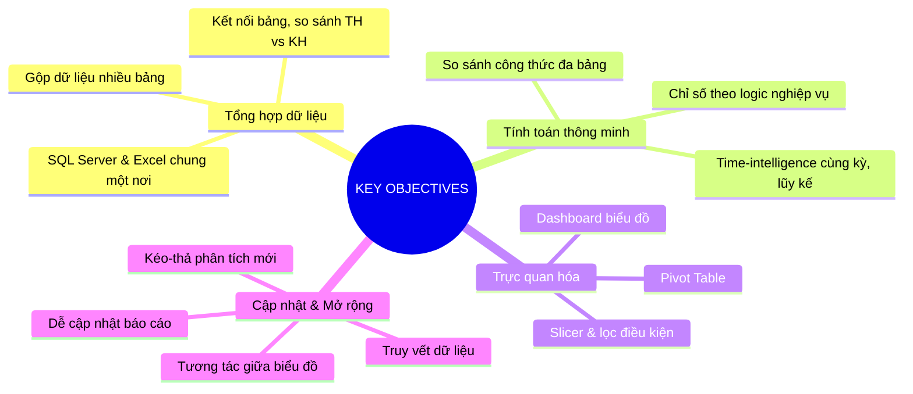

# 📊 PROJECT — KPIM Mart: Hệ Thống Báo Cáo Bán Hàng

> File tổng hợp **Key Information** theo quy trình KPIM. Mỗi thành phần là một **bảng chuẩn hóa** + **mindmap** (ảnh tách riêng trong `mindmaps/`). Chi tiết mở rộng ở các file: `DATA_DICTIONARY.md`, `METRICS_CALCULATION.md`, `DOMAIN_DIMENSION.md`, `REPORTS.md`, `DESIGN.md`.

## 0. Tóm tắt dự án
- **Khách hàng / hệ thống:** KPIM Mart (chuỗi bán lẻ).
- **Nghiệp vụ:** Bán hàng (Sales) — theo dõi doanh thu, lợi nhuận, khách hàng, cửa hàng, sản phẩm.
- **Bài toán:** dữ liệu nằm rời rạc ở **SQL Server** (danh mục), **SharePoint List** (đơn hàng), **Excel** (kế hoạch tháng) → cần tổng hợp một nơi, tính chỉ số theo logic nghiệp vụ, trực quan hóa và tự cập nhật.
- **Giải pháp:** Power BI (Data Model dùng chung + DAX + bộ báo cáo theo template).

---

## 1. REQUIREMENTS & OBJECTIVES (Yêu cầu & Mục tiêu)
🖼️ Mindmap: `mindmaps/key_objectives.png`

| Nhóm mục tiêu | Yêu cầu cụ thể |
|---|---|
| **Tổng hợp dữ liệu** | Gộp SQL Server + Excel + SharePoint về một nơi; kết nối các bảng; so sánh Thực hiện vs Kế hoạch; gộp dữ liệu nhiều bảng |
| **Tính toán thông minh** | Tính chỉ số theo logic nghiệp vụ; time-intelligence (cùng kỳ năm ngoái, lũy kế năm); so sánh công thức theo trường ở nhiều bảng |
| **Trực quan hóa** | Dashboard biểu đồ trực quan; bảng phân tích Pivot; slicer & lọc theo điều kiện |
| **Cập nhật & Mở rộng** | Kéo-thả tạo phân tích mới; truy vết thông tin/dữ liệu; dễ cập nhật dữ liệu-công thức-biểu đồ; tương tác giữa biểu đồ |

## 2. ANALYTICS QUESTIONS (Câu hỏi phân tích)
🖼️ Mindmap: `mindmaps/key_questions.png`

| Nhóm câu hỏi | Câu hỏi phân tích |
|---|---|
| **Hiện trạng chỉ số bán hàng?** | Doanh thu/số sản phẩm bán hiện tại bao nhiêu? Theo năm nay/tháng này? Theo từng cửa hàng/quản lý/sản phẩm? |
| **Kết quả KD có đạt chỉ tiêu?** | Cửa hàng nào đạt/không đạt? Quản lý nào? Tháng nào? |
| **Đang tăng trưởng hay suy giảm?** | Tổng DT tăng/giảm so cùng kỳ? Cửa hàng/SP nào tăng/giảm? Tháng vs tháng trước, quý vs quý trước? |
| **Yếu tố nào gây suy giảm DT?** | Cửa hàng tháng nào không đạt chỉ tiêu? Vượt ngưỡng lũy kế năm? Tháng giảm, cửa hàng nào giảm nhất? Truy vết cửa hàng suy giảm → sản phẩm nào bán giảm? |

## 3. DATA REQUIRED (Dữ liệu cần dùng)
🖼️ Bảng: `mindmaps/key_data_dictionary.png` · Chi tiết: `DATA_DICTIONARY.md`

| Nguồn | Nội dung | Vai trò |
|---|---|---|
| **SQL Server** | Danh mục: sản phẩm, khu vực, khách hàng… | Dimension |
| **SharePoint List** | Đơn hàng bán (form nhập mỗi khi phát sinh) | Fact (giao dịch) |
| **Excel** | Kế hoạch từng tháng theo khu vực (mỗi sheet 1 năm) | Fact kế hoạch / Target |

Bảng Fact chính (Đơn hàng bán) có **15 trường** — xem `DATA_DICTIONARY.md`.

## 4. METRICS & DIMENSIONS (Chỉ số & Chiều phân tích)
🖼️ Mindmap: `mindmaps/key_analysis.png` · Chi tiết: `METRICS_CALCULATION.md` + `DOMAIN_DIMENSION.md`

**Chỉ số chính (6 nhóm):** Doanh Thu · Lợi Nhuận Gộp · Tổng Khuyến Mãi · Số Sản Phẩm Bán · Số Khách Mua Hàng · Số Đơn Hàng (mỗi nhóm có measure phái sinh — xem `METRICS_CALCULATION.md`).

**Chiều phân tích (4 nhóm):** Thời gian (Ngày/Tháng/Quý/Năm) · Khách hàng (Phân khúc/Hạng thẻ/Nhóm tuổi/Giới tính) · Sản phẩm (Ngành hàng/Nhóm SP/Phân loại/Nguồn gốc/Hãng) · Khu vực bán hàng (Quận/Cửa hàng/Quản lý).

## 5. RESULT & DELIVERY (Danh sách báo cáo & Bàn giao)
🖼️ Mindmap: `mindmaps/key_report.png` · Chi tiết: `REPORTS.md`

**6 báo cáo (Report):** Tổng quan · Phân tích doanh thu · Phân tích tái mua hàng · Kết quả theo khu vực · Phân khúc khách hàng · Giám sát biên lợi nhuận gộp.

**Bàn giao:** file `.pbix/.pbip` + Data Model + measure table + tài liệu nghiệp vụ (bộ md này) + `Project_Management.xlsx` + hướng dẫn/đào tạo.

---
## Điều hướng
- Kế hoạch triển khai: `Project_Management.xlsx` (sheet PLANNING)
- Thiết kế: `DESIGN.md` + `theme.json`
- Quy trình đầy đủ: `00_REFERRAL_WORKFLOW.md`
- Chuẩn dựng báo cáo Power BI: `20_KNOWLEDGE/27_FRAMEWORKS/27.06_PowerBI_Report_Design_Standard`
